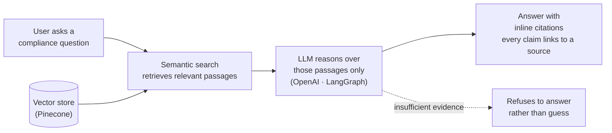

# How Starling Answers a Question

A retrieval-augmented generation (RAG) pipeline: the model answers only from retrieved source passages, never from memory alone.

- **Grounded** — answers come from retrieved regulation and policy passages, not model memory
- **Cited** — every claim carries an inline citation to its source document
- **Trustworthy** — when sources are insufficient, it says so instead of guessing
