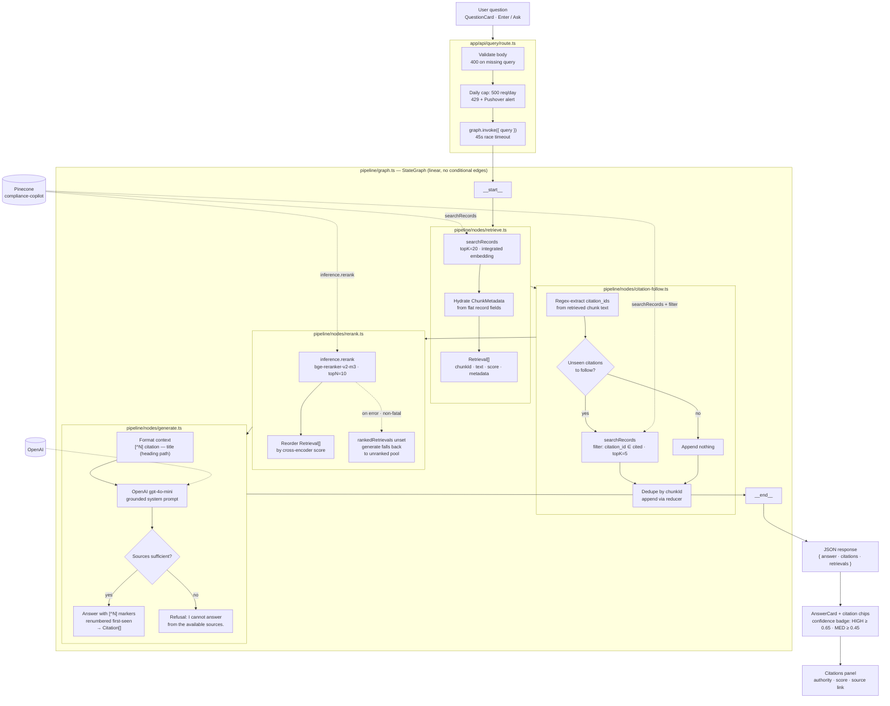

# Query → Answer — Runtime Architecture

How a user question becomes a grounded, source-cited answer. One `POST /api/query` call runs a linear LangGraph pipeline — `retrieve → citation-follow → rerank → generate` — over Pinecone and OpenAI, and returns a single JSON response.

---

## Overview

---

## Request handling

`app/api/query/route.ts` gates every call before the graph runs:

| Check | On failure |
|---|---|
| Body parses as JSON; `query` non-empty after trim | `400` invalid / missing query |
| In-process daily counter — 500 req/day, resets at UTC midnight | `429` + one-shot Pushover alert |
| `graph.invoke({ query })` wrapped in a 45s race timeout | `500` internal pipeline error |
| OpenAI credit / quota errors detected by error code | `402` insufficient_credits |

There is no query rewriting, clarification, or disambiguation — the raw query string flows end-to-end unchanged. Chat history is localStorage-only and never sent to the server.

---

## The graph

`pipeline/graph.ts` compiles a strictly linear StateGraph — no conditional edges (conditional routing is future work):

`__start__ → retrieve → citation-follow → rerank → generate → __end__`

State channels (`pipeline/state.ts`):

| Channel | Written by | Reducer |
|---|---|---|
| `query` | request input | replace |
| `retrievals` | retrieve, citation-follow | append (`[...a, ...b]`) |
| `rankedRetrievals` | rerank | replace |
| `answer`, `citations` | generate | replace |

Pinecone and OpenAI clients are built lazily once and cached on `globalThis` — HMR-safe singletons.

---

## Retrieval stages

- **retrieve** (`nodes/retrieve.ts`) — one `searchRecords` call with `topK=20`. The query is embedded server-side by Pinecone's integrated-embedding API (`text-embedding-3-small`, fixed at index creation). Oversampling gives rerank a real candidate pool. Each hit hydrates a `Retrieval { chunkId, text, score, metadata }` from the flat record fields.
- **citation-follow** (`nodes/citation-follow.ts`) — deterministic multi-hop. Regulator citations are regex-extracted from the retrieved chunk text (e.g. `17 CFR 240.17a-4` → `17-CFR-240.17a-4`, `Reg SHO Rule 203` → `17-CFR-242.203`), then a second search runs with `filter: { citation_id: { $in: [...] } }`, `topK=5`, ranked by similarity to the original query. New chunks are deduped by id and appended via the state reducer. No unseen citations → appends nothing.
- **rerank** (`nodes/rerank.ts`) — Pinecone hosted cross-encoder `bge-reranker-v2-m3`, `topN=10`, reordering the original Retrieval objects (metadata preserved) into `rankedRetrievals`. **Failure is non-fatal**: on API error the node logs and returns `{}`, leaving `rankedRetrievals` unset so generate falls back to the unranked pool — better a slightly worse answer than no answer.

---

## Grounded generation

`nodes/generate.ts` calls OpenAI `gpt-4o-mini` (non-streaming, `max_tokens: 1024`) with a strict system prompt: answer ONLY from the provided chunks, cite claims with `[^N]` markers, never fabricate, and when the chunks are empty or insufficient respond with exactly `"I cannot answer from the available sources."` — that exact string is the entire refusal mechanism; there is no programmatic sufficiency gate.

Context formatting is load-bearing: every chunk gets a numbered header — `[^N] {citationIdDisplay} — {title} ({headingPath})` — which is how the model verifies rule-naming questions. Without the headers it conservatively refuses.

Post-processing renumbers `[^N]` markers by first-seen order, drops out-of-range or fabricated markers, and emits `Citation[] = { chunkId, marker }` (e.g. `{ chunkId: "FINRA-Rule-3110::.09::p0", marker: "[^1]" }`).

---

## Response & UI

The answer is not streamed — one JSON response:

| Field | Contents |
|---|---|
| `answer` | text with renumbered `[^N]` markers, or the refusal string |
| `citations` | `{ chunkId, marker }[]` — valid, in-range markers only |
| `retrievals` | the full candidate pool (retrieve ∪ citation-follow), not just the ranked top-10 |

The client renders:

- **AnswerCard** — each `[^N]` becomes a clickable citation chip with a chunk-excerpt tooltip.
- **ConfidenceBadge** — computed client-side from the max retrieval score: HIGH ≥ 0.65, MEDIUM ≥ 0.45, else LOW. A UI heuristic, not a graph node.
- **Citations panel** — per citation: authority chip, `citationIdDisplay`, similarity score, `versionStatus` + `effectiveDate`, chunk excerpt, and an "Open source" deep link.
- **Trace section** — collapsible retrieve / generate view: index name, embedding model, k, per-candidate scores.

---

## Module responsibilities

| Module | Responsibility |
|---|---|
| `app/api/query/route.ts` | HTTP boundary: validation, daily cap, timeout, error mapping, response shaping. |
| `pipeline/graph.ts` | Graph wiring + singleton Pinecone / OpenAI clients. |
| `pipeline/nodes/retrieve.ts` | Dense retrieval via integrated embedding. |
| `pipeline/nodes/citation-follow.ts` | Deterministic citation multi-hop (filtered second search). |
| `pipeline/nodes/rerank.ts` | Hosted cross-encoder rerank with non-fatal fallback. |
| `pipeline/nodes/generate.ts` | Grounded LLM answer + citation parsing / renumbering. |

---

## Evaluation reuse

The evaluation harness invokes the same graphs — retrieval evals run a retrieval-only graph (the chain minus generate), and answer evals run the full graph per benchmark item, scored for faithfulness by a `gpt-4.1-nano` judge — so benchmark numbers measure the exact pipeline users hit.
